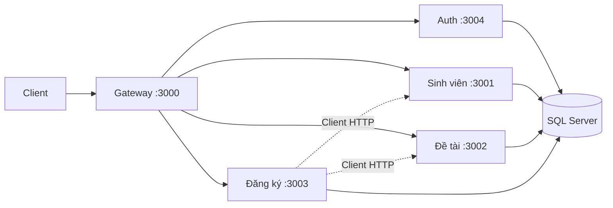

# Demo NestJS SOA

Nền tảng quản lý đồ án tốt nghiệp theo kiến trúc hướng dịch vụ, dùng NestJS 12, TypeScript ESM và SQL Server. Hiện có đăng nhập, JWT và health; chưa có CRUD nghiệp vụ.



| Thành phần | Cổng | Bảng sở hữu theo thiết kế |
| --- | --- | --- |
| gateway | 3000 | Không có |
| svc-auth | 3004 | dbo.User |
| svc-sinhvien | 3001 | SINHVIEN, chưa triển khai |
| svc-detai | 3002 | DETAI, chưa triển khai |
| svc-dangky | 3003 | DANGKY, chưa triển khai |

Quyền sở hữu bảng là quy ước, chưa được cưỡng chế bằng tài khoản SQL riêng.

## Chạy nhanh

Cần Windows, PowerShell, Node.js 24 LTS, npm, SQL Server và Microsoft ODBC Driver 17 for SQL Server phù hợp kiến trúc Node. Windows Authentication dùng tài khoản chạy tiến trình; SQL Authentication cần DB_USER và DB_PASSWORD.

Từ thư mục gốc:

```powershell
Copy-Item .env.example .env
foreach ($name in @('gateway','svc-auth','svc-sinhvien','svc-detai','svc-dangky')) {
  Copy-Item "$name/.env.example" "$name/.env"
}
# Sửa .env: DB_HOST, DB_NAME, JWT_SECRET ngẫu nhiên tối thiểu 32 ký tự.
./scripts/install-all.ps1
# Chuẩn bị database và chạy db/schema.sql, db/seed.sql theo db/README.md.
./scripts/start-all.ps1
Invoke-RestMethod http://localhost:3000/health
```

Nếu Windows chặn chạy script, dùng `powershell -NoProfile -ExecutionPolicy Bypass -File scripts/install-all.ps1` và tương tự với `scripts/start-all.ps1`. Đây là tùy chọn cho tiến trình hiện tại, không đổi chính sách hệ thống. Kết quả kiểm tra và lệnh chạy lại nằm ở [báo cáo nghiệm thu](docs/BAO-CAO-NGHIEM-THU.md).

Chạy riêng: vào thư mục service rồi chạy `npm.cmd run start:dev` để xem log trực tiếp. Script khởi động chạy tiến trình nền. Không commit `.env`. Thử đăng nhập và API bằng [docs/api-test.http](docs/api-test.http). Chỉ POST /auth/login và GET /health công khai tại gateway. Swagger trực tiếp tại /api trên cổng 3001–3004.

## Lỗi thường gặp

| Hiện tượng | Cách kiểm tra |
| --- | --- |
| Không kết nối DB | DB_HOST, DB_NAME, cổng/instance, TCP/IP, firewall và quyền đăng nhập |
| Thiếu ODBC Driver 17 | Cài driver, đặt DB_ODBC_DRIVER đúng tên đã cài |
| EADDRINUSE | Kiểm tra Get-NetTCPConnection, đổi PORT và URL liên quan |
| 401 | Gửi Bearer token hợp lệ, kiểm tra hạn dùng |
| JWT_SECRET không khớp | Gateway và auth phải đọc cùng secret, khởi động lại sau khi đổi |
| Health 503 | Kiểm tra tiến trình và DB của service bị đánh dấu down |

## Cây thư mục

```text
gateway/          Xác thực, chuyển tiếp HTTP và health tổng hợp
svc-auth/         Đăng nhập và phát JWT
svc-sinhvien/     Nền tảng sinh viên, hiện chỉ health
svc-detai/        Nền tảng đề tài, hiện chỉ health
svc-dangky/       Nền tảng đăng ký và client HTTP
shared/database/  Package pool SQL và truy vấn tham số
db/               Schema User và seed minh họa
docs/             Kiến trúc, học code và API
scripts/          Cài đặt, khởi động PowerShell
.env.example      Biến chung, không chứa secret thật
```

Đọc [kiến trúc](docs/KIEN-TRUC.md), [lộ trình học](docs/HUONG-DAN-HOC.md), [API](docs/API.md), [hỏi đáp](docs/HOI-DAP-BAO-VE.md) và [chuẩn bị DB](db/README.md). Chưa có phân quyền vai trò, giao dịch phân tán, retry hay triển khai production.
