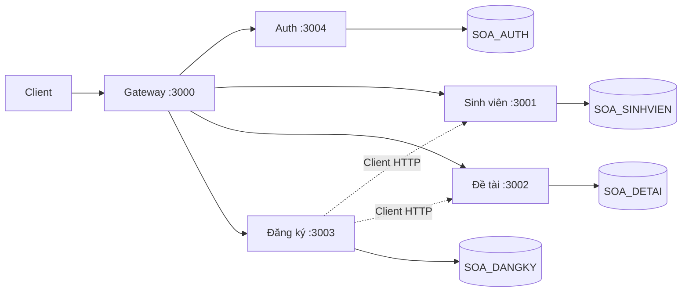

# Demo NestJS SOA

Nền tảng quản lý đồ án tốt nghiệp theo kiến trúc hướng dịch vụ, dùng NestJS 12, TypeScript ESM và SQL Server. Hiện có đăng nhập, JWT, health và CRUD sinh viên; đề tài và đăng ký chưa có CRUD.



| Thành phần | Cổng | Database | Bảng sở hữu |
| --- | --- | --- | --- |
| gateway | 3000 | Không có | Không có |
| svc-auth | 3004 | SOA_AUTH | dbo.User |
| svc-sinhvien | 3001 | SOA_SINHVIEN | SINHVIEN, đã có CRUD |
| svc-detai | 3002 | SOA_DETAI | DETAI, chưa có CRUD |
| svc-dangky | 3003 | SOA_DANGKY | DANGKY, chưa có CRUD |

Mỗi service đặt DB_NAME trong .env riêng; thông tin SQL Server dùng chung từ .env gốc. Quyền truy cập chưa được giới hạn bằng tài khoản SQL riêng. Không có khóa ngoại giữa các database; kiểm tra quan hệ nghiệp vụ cần thực hiện qua service.

## Chạy nhanh

Cần Windows, PowerShell, Node.js 24 LTS, npm, SQL Server và Microsoft ODBC Driver 17 for SQL Server phù hợp kiến trúc Node. Windows Authentication dùng tài khoản chạy tiến trình; SQL Authentication cần DB_USER và DB_PASSWORD.

Từ thư mục gốc:

```powershell
Copy-Item .env.example .env
foreach ($name in @('gateway','svc-auth','svc-sinhvien','svc-detai','svc-dangky')) {
  Copy-Item "$name/.env.example" "$name/.env"
}
# Sửa .env: DB_HOST, DB_NAME, JWT_SECRET ngẫu nhiên tối thiểu 32 ký tự.
./scripts/install-all.ps1
# Tạo 4 database và bảng bằng các file db/separate/01-auth.sql đến 04-dangky.sql.
# Chuẩn bị tài khoản quản trị trong SOA_AUTH.dbo.User; Password phải là bcrypt hash.
./scripts/start-all.ps1
Invoke-RestMethod http://localhost:3000/health
```

Nếu Windows chặn chạy script, dùng `powershell -NoProfile -ExecutionPolicy Bypass -File scripts/install-all.ps1` và tương tự với `scripts/start-all.ps1`. Đây là tùy chọn cho tiến trình hiện tại, không đổi chính sách hệ thống. Kết quả kiểm tra và lệnh chạy lại nằm ở [báo cáo nghiệm thu](docs/BAO-CAO-NGHIEM-THU.md).

Chạy riêng: vào thư mục service rồi chạy `npm.cmd run start:dev` để xem log trực tiếp. Script khởi động chạy tiến trình nền. Không commit `.env`. Thử đăng nhập và API bằng [docs/api-test.http](docs/api-test.http). Chỉ POST /auth/login và GET /health công khai tại gateway. Swagger trực tiếp tại /api trên cổng 3001–3004.

## Frontend Angular

Frontend Angular nằm trong [FE_Demo_SOA_AG](FE_Demo_SOA_AG/README.md). Sau khi backend chạy, mở terminal trong thư mục đó, chạy `npm.cmd install` và `npm.cmd start`, rồi vào http://localhost:4200. Frontend có đăng nhập, CRUD sinh viên và trạng thái đề tài/đăng ký; mỗi service có component và Angular service riêng. Proxy phát triển chuyển `/api/*` đến gateway cổng 3000.

## Lỗi thường gặp

| Hiện tượng | Cách kiểm tra |
| --- | --- |
| Không kết nối DB | DB_HOST, DB_NAME, cổng/instance, TCP/IP, firewall và quyền đăng nhập |
| Thiếu ODBC Driver 17 | Cài driver, đặt DB_ODBC_DRIVER đúng tên đã cài |
| EADDRINUSE | Kiểm tra Get-NetTCPConnection, đổi PORT và URL liên quan |
| 401 | Gửi Bearer token hợp lệ, kiểm tra hạn dùng |
| JWT_SECRET không khớp | Gateway và các service phải đọc cùng secret, khởi động lại sau khi đổi |
| Đăng nhập 401 sau khi tách DB | Kiểm tra tài khoản nằm trong SOA_AUTH.dbo.User; dữ liệu SOA_DATN không tự chuyển sang |
| Health 503 | Kiểm tra tiến trình và DB của service bị đánh dấu down |

## Cây thư mục

```text
gateway/          Xác thực, chuyển tiếp HTTP và health tổng hợp
svc-auth/         Đăng nhập và phát JWT
svc-sinhvien/     CRUD sinh viên và health
svc-detai/        Nền tảng đề tài, hiện chỉ health
svc-dangky/       Nền tảng đăng ký và client HTTP
shared/database/  Package pool SQL và truy vấn tham số
db/               Schema User và seed minh họa
docs/             Kiến trúc, học code và API
scripts/          Cài đặt, khởi động PowerShell
.env.example      Biến chung, không chứa secret thật
```

Đọc [kiến trúc](docs/KIEN-TRUC.md), [lộ trình học](docs/HUONG-DAN-HOC.md), [API](docs/API.md), [hỏi đáp](docs/HOI-DAP-BAO-VE.md) và [chuẩn bị DB](db/README.md). Chưa có phân quyền vai trò, giao dịch phân tán, retry hay triển khai production.
