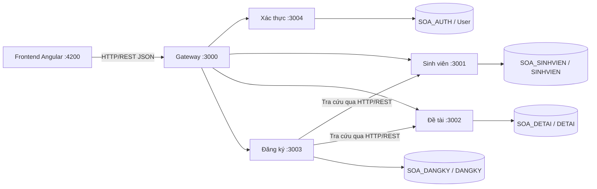
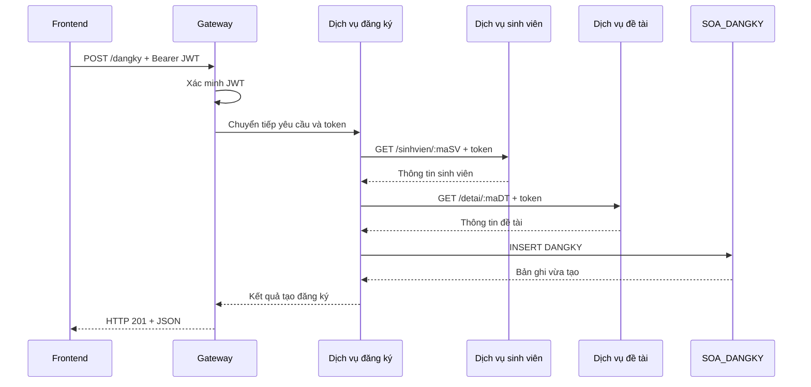

# Demo SOA — Quản lý đồ án tốt nghiệp

Dự án demo xây dựng các dịch vụ web bằng **NestJS** cho bài toán khoa quản lý đồ án tốt nghiệp của sinh viên theo **kiến trúc hướng dịch vụ (SOA)**. Các dịch vụ có trách nhiệm riêng, chạy trong các tiến trình độc lập và phối hợp qua **HTTP/REST**, trao đổi dữ liệu JSON.

Ba nghiệp vụ chính sử dụng các bảng **SINHVIEN**, **DETAI** và **DANGKY** trong SQL Server. Giao diện Angular hỗ trợ thao tác CRUD; dịch vụ xác thực và gateway hỗ trợ đăng nhập, bảo vệ API và truy cập hệ thống.

## 1. Yêu cầu và phạm vi demo

| Yêu cầu bài thực hành | Cách thể hiện trong dự án |
| --- | --- |
| Dùng framework đã nghiên cứu để cài đặt dịch vụ web | NestJS xây dựng controller, xử lý nghiệp vụ và kết nối SQL Server |
| Dịch vụ độc lập | Mỗi service có `package.json`, điểm khởi động, cấu hình và cổng HTTP riêng; có thể chạy riêng từng tiến trình |
| Phối hợp và trao đổi dữ liệu qua HTTP/REST | Gateway chuyển tiếp yêu cầu; dịch vụ đăng ký gọi API sinh viên và đề tài khi tạo/sửa đăng ký |
| Giao tiếp qua giao thức chuẩn | HTTP, các phương thức GET/POST/PATCH/DELETE và dữ liệu JSON; có Swagger tại từng service |
| Có thể tái sử dụng | API nghiệp vụ phục vụ Angular, công cụ thử API hoặc ứng dụng khác; dịch vụ đăng ký tái sử dụng API tra cứu sinh viên và đề tài |
| CRUD cơ bản của bài toán | Thêm, xem danh sách/chi tiết, sửa và xóa sinh viên, đề tài, đăng ký |

Ba dịch vụ sinh viên, đề tài và đăng ký là trọng tâm nghiệp vụ SOA. Đăng nhập JWT, health check và giao diện Angular là các phần hỗ trợ trình diễn.

## 2. Kiến trúc hệ thống



| Thành phần | Cổng | Trách nhiệm | Database |
| --- | --- | --- | --- |
| `gateway` | 3000 | Xác thực yêu cầu, định tuyến và tổng hợp health | Không có |
| `svc-auth` | 3004 | Kiểm tra tài khoản, mật khẩu bcrypt và phát JWT | `SOA_AUTH` |
| `svc-sinhvien` | 3001 | CRUD sinh viên | `SOA_SINHVIEN` |
| `svc-detai` | 3002 | CRUD đề tài | `SOA_DETAI` |
| `svc-dangky` | 3003 | CRUD đăng ký, kiểm tra sinh viên/đề tài qua API | `SOA_DANGKY` |
| `FE_Demo_SOA_AG` | 4200 | Giao diện đăng nhập và quản lý ba nghiệp vụ | Không có |

Mỗi dịch vụ nghiệp vụ truy vấn database của mình. Dịch vụ đăng ký tra cứu sinh viên và đề tài qua API thay vì truy vấn trực tiếp database của hai dịch vụ đó.

Các database hiện cùng nằm trên một SQL Server instance. Cấu hình máy chủ và JWT dùng chung từ `.env` gốc; từng service đặt `DB_NAME` trong `.env` riêng. Quyền SQL chưa được giới hạn bằng tài khoản riêng cho mỗi service.

## 3. Chức năng và API chính

| Nghiệp vụ | Chức năng | Đường dẫn qua gateway |
| --- | --- | --- |
| Xác thực | Đăng nhập, nhận JWT | `POST /auth/login` |
| Sinh viên | Thêm, xem danh sách/chi tiết, sửa, xóa | `/sinhvien`, `/sinhvien/:maSV` |
| Đề tài | Thêm, xem danh sách/chi tiết, sửa, xóa | `/detai`, `/detai/:maDT` |
| Đăng ký | Thêm, xem danh sách/chi tiết, sửa, xóa | `/dangky`, `/dangky/:maDK` |
| Health | Kiểm tra trạng thái các dịch vụ | `GET /health` |

Quy ước CRUD: `POST` tạo mới, `GET` đọc dữ liệu, `PATCH` cập nhật, `DELETE` xóa. Các API CRUD yêu cầu `Authorization: Bearer <token>`, bao gồm khi gọi trực tiếp service.

Frontend có màn hình riêng cho từng nghiệp vụ. Form đăng ký lấy danh sách sinh viên và đề tài từ API để người dùng chọn.

Xem trường dữ liệu và hợp đồng tại [tài liệu API](docs/API.md); thử yêu cầu bằng [api-test.http](docs/api-test.http).

## 4. Luồng phối hợp minh họa SOA

Khi tạo đăng ký đề tài, dịch vụ đăng ký gọi hai dịch vụ khác để kiểm tra mã sinh viên và mã đề tài trước khi lưu:



Luồng này đã có trong [dịch vụ đăng ký](svc-dangky/src/app.service.ts) và [các client HTTP](svc-dangky/src/clients). Khi kiểm tra tham chiếu thất bại, thao tác không tiếp tục ghi đăng ký. Luồng cập nhật cũng kiểm tra sinh viên và đề tài qua API.

API sinh viên và đề tài phục vụ đồng thời giao diện quản lý và dịch vụ đăng ký, thể hiện khả năng tái sử dụng dịch vụ qua hợp đồng HTTP.

## 5. Công nghệ sử dụng

- **Backend:** NestJS 12, TypeScript ESM, HTTP/REST và Axios.
- **Frontend:** Angular 22, Angular service và proxy phát triển đến gateway.
- **Database:** SQL Server, `mssql`/`msnodesqlv8`, Microsoft ODBC Driver 17.
- **Xác thực:** JWT và bcrypt.
- **Tài liệu API:** Swagger tại từng service.
- **Công cụ chạy demo:** Node.js 24 LTS, npm và PowerShell trên Windows.

`shared/database` cung cấp pool kết nối và truy vấn có tham số để các service tái sử dụng phần truy cập SQL.

## 6. Clone và chạy dự án

Chuẩn bị Git, Node.js 24 LTS, SQL Server, SSMS và ODBC Driver 17 phù hợp kiến trúc Node.js. Người clone cần tự tạo `.env` và database trên máy của mình.

### Bước 1: Clone và tạo cấu hình

```powershell
git clone https://github.com/tuwns05/Demo_Nest_JS_SOA.git
cd Demo_Nest_JS_SOA

Copy-Item .env.example .env
foreach ($name in @('gateway','svc-auth','svc-sinhvien','svc-detai','svc-dangky')) {
  Copy-Item "$name/.env.example" "$name/.env"
}
```

Điền thông tin SQL Server trong `.env` gốc: `DB_HOST`, cổng hoặc instance, phương thức xác thực và `DB_ODBC_DRIVER`. Có thể đặt `DB_NAME=SOA_AUTH` ở file gốc; các service đã có `DB_NAME` riêng trong file mẫu. Giữ `DB_CONNECTION_STRING` trống khi dùng cấu hình theo từng database.

Tạo secret rồi sao chép kết quả vào `JWT_SECRET` trong `.env` gốc:

```powershell
node -e "console.log(require('node:crypto').randomBytes(32).toString('hex'))"
```

### Bước 2: Tạo database và tài khoản demo

Trong SSMS, kết nối cùng SQL Server đã cấu hình và chạy toàn bộ từng file `db/separate/01-auth.sql` đến `04-dangky.sql`. Các script tạo bốn database và bảng tương ứng.

Sau đó **chọn database `SOA_AUTH`** và chạy `db/seed.sql` để tạo tài khoản mẫu:

```text
Tên đăng nhập: demo
Mật khẩu:      Demo@123456
```

### Bước 3: Chạy backend

Từ thư mục gốc, chạy trong PowerShell:

```powershell
powershell -NoProfile -ExecutionPolicy Bypass -File scripts/install-all.ps1
powershell -NoProfile -ExecutionPolicy Bypass -File scripts/start-all.ps1
```

Chờ các service khởi động rồi kiểm tra:

```powershell
Invoke-RestMethod http://localhost:3000/health
```

Script khởi động chạy các tiến trình trong cửa sổ ẩn. Để xem log trực tiếp, thay cho script khởi động, mở terminal riêng trong mỗi thư mục backend và chạy `npm.cmd run start:dev`.

### Bước 4: Chạy frontend

Mở terminal mới tại thư mục gốc:

```powershell
cd FE_Demo_SOA_AG
npm.cmd ci
npm.cmd start
```

Truy cập **http://localhost:4200** và đăng nhập bằng tài khoản mẫu. Proxy phát triển chuyển `/api/*` đến gateway cổng 3000.

Hướng dẫn cấu hình chi tiết, cách dừng tiến trình và xử lý lỗi nằm tại [Hướng dẫn triển khai](docs/HUONG-DAN-TRIEN-KHAI.md). Không commit `.env` chứa mật khẩu hoặc JWT secret thật.

## 7. Kịch bản trình diễn

1. Khởi động các dịch vụ, gọi `/health` để kiểm tra trạng thái.
2. Đăng nhập và nhận JWT.
3. Thêm sinh viên và đề tài, thử xem và sửa dữ liệu ở từng màn hình.
4. Tạo đăng ký bằng sinh viên và đề tài vừa thêm; trình bày luồng gọi HTTP giữa các dịch vụ ở mục 4.
5. Sửa, xem và xóa đăng ký; xóa đăng ký trước khi xóa sinh viên hoặc đề tài liên quan.
6. Dừng riêng một service, gọi lại `/health` để quan sát trạng thái lỗi và thử API của service khác vẫn đang chạy.

Swagger trực tiếp: `http://localhost:3001/api` đến `http://localhost:3004/api`.

## 8. Cấu trúc thư mục

```text
FE_Demo_SOA_AG/   Giao diện Angular
gateway/          Cổng vào HTTP, xác thực và health tổng hợp
svc-auth/         Đăng nhập và phát JWT
svc-sinhvien/     CRUD sinh viên
svc-detai/        CRUD đề tài
svc-dangky/       CRUD đăng ký và client gọi dịch vụ khác
shared/database/  Thư viện kết nối và truy vấn SQL dùng chung
db/separate/      Script tạo database/bảng riêng từng service
db/seed.sql       Tài khoản demo
docs/             Tài liệu triển khai, API và bài học
scripts/          Script cài đặt và khởi động backend
.env.example      Mẫu cấu hình dùng chung
```

## 9. Giới hạn hiện tại

Demo thể hiện các đặc trưng SOA trong phạm vi bài thực hành. Các service chạy riêng nhưng vẫn dùng chung SQL Server instance, JWT secret và thư viện database. Chưa có phân quyền theo vai trò, giao dịch phân tán, retry hoặc cấu hình triển khai production.

Giữa các database không có khóa ngoại. Luồng tạo/sửa đăng ký đã kiểm tra tham chiếu qua API, nhưng chưa bảo đảm toàn vẹn khi có thao tác đồng thời hoặc khi xóa sinh viên/đề tài đang được đăng ký. Chưa có phân trang và chặn đăng ký trùng. Khi chạy demo, xóa đăng ký liên quan trước khi xóa sinh viên/đề tài.

Tài liệu bổ sung: [Hướng dẫn triển khai](docs/HUONG-DAN-TRIEN-KHAI.md), [API](docs/API.md), [Database riêng từng service](db/separate/README.md), [Frontend](FE_Demo_SOA_AG/README.md).
