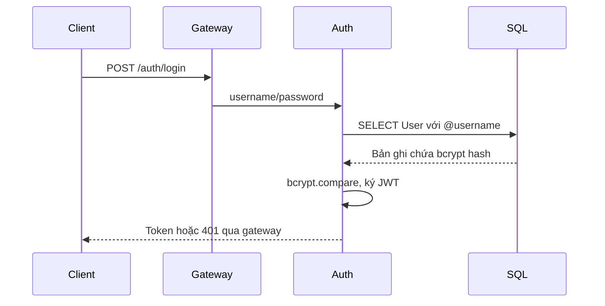
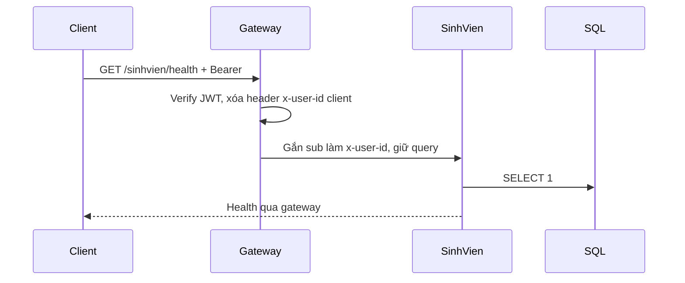
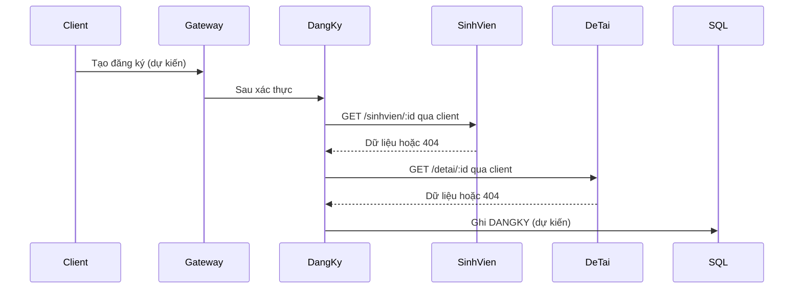
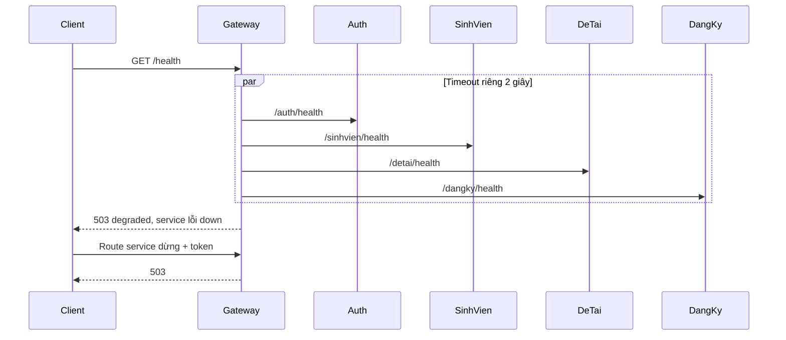

# Kiến trúc SOA

SOA chia hệ thống thành dịch vụ có trách nhiệm và hợp đồng giao tiếp rõ ràng. Repo dùng HTTP; SOA không bắt buộc có ESB.

| Đặc điểm | Bằng chứng trong code |
| --- | --- |
| Tiến trình độc lập | Mỗi thư mục service có package.json, src/main.ts và PORT riêng |
| Cổng vào tập trung | gateway/src/app.controller.ts ánh xạ tài nguyên sang URL |
| Hợp đồng HTTP | Controller auth và health, docs/API.md |
| Hạ tầng chung | shared/database cung cấp register() và query có tham số |
| Gọi chéo | svc-dangky/src/clients, chưa có endpoint đăng ký |
| Xác thực | Auth ký JWT, gateway xác minh trước khi chuyển tiếp |

Gateway định tuyến, xác thực và kiểm tra health. ESB thường có chuyển đổi thông điệp, tích hợp nhiều giao thức và điều phối tập trung; repo chưa có các khả năng đó. Demo dùng chung DB và thư viện, chưa độc lập vận hành hoàn toàn như một hệ microservices trưởng thành.

## Đăng nhập

## API có token

Token sai bị chặn trước khi gọi service. Service nghiệp vụ chưa tự kiểm tra JWT; tầng triển khai phải hạn chế truy cập trực tiếp. Chưa có mTLS.

## Tạo đăng ký: luồng dự kiến, chưa triển khai

Hiện chỉ có client HTTP; endpoint tra cứu và tạo đăng ký chưa có. Chưa xử lý giao dịch phân tán, saga hoặc tranh chấp chỉ tiêu.

## Một service dừng

Route của các service còn sống tiếp tục hoạt động. SQL Server dùng chung vẫn là điểm lỗi chung; health không tự phục hồi dịch vụ.
